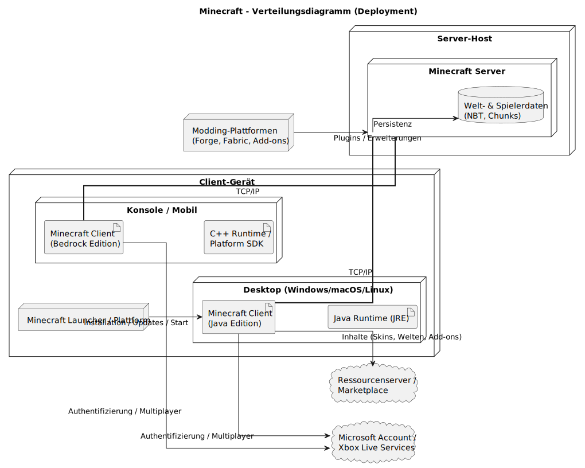

# arc42 Architektur-Dokumentation – Minecraft (didaktisches Modell)

Dieses Dokument beschreibt in vereinfachter, didaktischer Form die Architektur von Minecraft auf Basis des arc42-Templates. Inhalte sind bewusst knapp gehalten und auf die geforderten Kapitel reduziert.

---

## 1. Einführung und Ziele
Minecraft ist eine Open-World-Sandbox-Anwendung, in der Benutzer eine virtuelle Welt aus Blöcken erkunden, gestalten und verändern können. Das System kombiniert Elemente von Simulation, Kreativität, Überleben und Mehrspieler-Interaktion. Minecraft ist in Java (für die Java Edition) bzw. in C++ (für die Bedrock Edition) entwickelt und läuft plattformübergreifend auf Windows, macOS, Linux, Konsolen und Mobilgeräten.  

### 1.1 Aufgabenstellung
- Bereitstellung einer stabilen, performanten und erweiterbaren Spielplattform mit persistenter, chunk-basierter Welt, Einzel- und Mehrspielerbetrieb sowie klaren Erweiterungspunkten.

### 1.2 Qualitätsziele
- **Performance und Skalierung:** Stabile Tick-Rate, effizientes Chunk-Streaming auch bei vielen Spielern und Entities.
- **Stabilität und Datenintegrität:** Verlässliche Speicherung von Welten und Spielerzuständen, robuste Lade- und Speicherpfade.
- **Erweiterbarkeit:** Mods/Plugins/Datapacks über klar definierte Schnittstellen und APIs integrierbar.
- **Sicherheit und Fairness:** Serverseitige Autorität, Authentifizierung und Berechtigungssysteme (Permissions).
- **Wartbarkeit und Transparenz:** Logging, Konfiguration und nachvollziehbare Schnittstellen für Betrieb und Support.

### 1.3 Stakeholder
- Spielende
- Community-Entwickelnde (Mods/Plugins/Tools)
- Server-Administrationen / Hoster
- Hersteller / Produktverantwortliche

---

## 2. Randbedingungen

### 2.1 Technische Randbedingungen

- Sprachen/Plattformen: Java (Java Edition), C++ (Bedrock), Plattformen Desktop/Mobile/Konsole.
- Architekturgrundsatz: Durchgängiges Client-Server-Modell mit serverseitiger Autorität.
- Persistenz: Chunk-basierte Speicherung in binären, strukturierten Formaten (z. B. NBT) für Welt- und Spielerzustände.
- Netzwerk: Paketbasiertes Protokoll über TCP/IP bzw. etablierte Transportprotokolle.
>>>>>>> 6c69fe303946fd8dbe0523e8f14a5670ee9983da

### 2.2 Organisatorische Randbedingungen
- Kontinuierliche Weiterentwicklung bei Schutz bestehender Welten (Abwärtskompatibilität und Migration).
- Aktive Community-Unterstützung (Erweiterbarkeit, stabile APIs an definierten Punkten).

---

## 3. Kontextabgrenzung

### 3.1 Fachlicher Kontext

Minecraft ermöglicht die Interaktion von Spielenden mit einer prozedural generierten, blockbasierten Spielwelt (Bauen, Sammeln, Kämpfen, Automation) in verschiedenen Modi (Singleplayer, Multiplayer, Realms). Server-Admins konfigurieren Regeln und Welten, Plattformbetreiber stellen Distribution, Authentifizierung und optionale Zusatzdienste bereit.
>>>>>>> 6c69fe303946fd8dbe0523e8f14a5670ee9983da

### 3.2 Technischer Kontext
Externe Dienste:
- Authentifizierung und Accounts (Microsoft / Xbox Services)
- Launcher-/Update-/Content-Server
- Mod- und Plugin-Repositorien
- Optionale Telemetrie / Analytik

Schnittstellen:
- Ressourcen- und Datapacks (Content-Erweiterungen)
- Plugin-/Modding-Schnittstellen (Forge/Fabric, Bukkit/Spigot/Paper etc.)

### 3.3 Kontextdiagramm
Siehe **Abbildung 1: Kontextdiagramm Minecraft-Referenzarchitektur** (Client, Server, Auth-Services, Launcher, Mod-Repos, lokales Dateisystem).

### 3.4 Anwendungsfalldiagramm  
Die Basis-Use-Cases des Minecraft-Clients (Anmelden, Singleplayer spielen, Multiplayer-Spiel beitreten, Inhalte laden/kaufen, Profil verwalten) sowie des Minecraft-Launchers (Anmelden, Version auswählen, Spiel starten, Updates herunterladen) sind in **Abbildung 2 und 3: Anwendungsfalldiagramme Minecraft** dargestellt.  

>>>>>>> 6c69fe303946fd8dbe0523e8f14a5670ee9983da
---

## 4. Lösungsstrategie
- Serverseitig autoritative Spiel- und Konsistenzlogik.
- Chunk-basierte Weltrepräsentation und Streaming.
- Event-/Tick-getriebene Verarbeitung mit deterministischen Regeln.
- Erweiterbarkeit über definierte Extension-Points (Datapacks, Plugins/Mods).
- Klare Trennung von Client-Rendering und Server-Logik.

(Details zu den wichtigsten Entscheidungen siehe Kapitel 9.)

---

## 5. Bausteinsicht
Hauptbausteine:

- **Client:** Rendering, Eingabe, UI, lokaler Cache sowie optional integrierter Server im Singleplayer.
- **Server:** Verwaltung von Welt- und Spielzustand, Game-Loop/Ticks, Regeln, KI, Weltspeicher.
- **Persistenz:** Speicherung von Welten, Spielerständen und Konfigurationen in strukturierten, binären Formaten (z. B. NBT, Region-Dateien).
- **Netzwerk:** Sitzungs- und Paketverwaltung, Serialisierung/Kompression, Behandlung von Latenz und Paketverlust.

---

## 6. Laufzeitsicht
### 6.1 Verbindungsaufbau
1. Client authentifiziert sich über Microsoft/Xbox Services.
2. Client baut TCP/IP-Verbindung zum (Realms- oder eigenen) Server auf.
3. Server prüft Berechtigungen und sendet Initialdaten (Spielerzustand, Spawn-Position, erste Chunks).
4. Client lädt/initialisiert Ressourcen und wechselt in den laufenden Spielzustand.

### 6.2 Spieltakt (Tick)
1. Client sendet Eingaben (Bewegung, Aktionen) an den Server.
2. Server verarbeitet pro Tick alle Eingaben, Entities, Physik und Regeln.
3. Server aktualisiert den Weltzustand und berechnet relevante Deltas je Spieler.
4. Server sendet Deltas (Positionsupdates, Blockänderungen, Events) an die verbundenen Clients.
5. Clients rendern den neuen Zustand lokal.

---

## 7. Verteilungssicht
Typische Topologien:
- Clients (Desktop, Konsole, Mobile) ↔ dedizierter Minecraft-Server (Java/Bedrock).
- Alternativ: Realms als Managed Service in der Cloud.
- Singleplayer: Integrierter Server läuft lokal im Client-Prozess.
>>>>>>> 6c69fe303946fd8dbe0523e8f14a5670ee9983da

### 7.1 Verteildiagramm
Siehe **Abbildung 4: Verteilungsdiagramm Minecraft** (Desktop-Client, Bedrock-Client, Realms-Server, eigener Server, Storage und optionale Plugin-Datenbank).

---

## 8. Querschnittliche Konzepte
- Persistenz/Dateiformate (z. B. NBT) und Migration alter Welten.
- Konfiguration, Logging und Monitoring.
- Sicherheit (Authentifizierung/Autorisierung, Rechte, grundlegende Anti-Cheat-Mechanismen).
- Erweiterbarkeit (Datapacks/Plugins, Versionierung und Stabilität der APIs).
- Fehler- und Ressourcenmanagement (Speicher, Threads, IO, Chunk-Loading).
>>>>>>> 6c69fe303946fd8dbe0523e8f14a5670ee9983da

---

## 9. Architekturentscheidungen
- Client-Server mit serverseitiger Autorität für Konsistenz und Fairness.
- Chunking als Strategie für Skalierung und Streaming der Welt.
- Erweiterbarkeit über klar abgegrenzte Extension-Points (Datapacks, Plugin-APIs).
- Binäre, strukturierte Datenformate für Welten und Zustände.

---

## 10. Qualitätsanforderungen (Szenarien)
- **Performance:** Welt-Streaming liefert sichtbare Chunks in ≤ 200 ms (didaktischer Richtwert).
- **Stabilität:** Welt-Speicheroperationen bleiben konsistent bei Crash/Recovery (keine korrupten Chunks).
- **Sicherheit:** Unautorisierte Aktionen werden serverseitig verworfen und protokolliert; kompromittierte Clients können die Welt nicht inkonsistent manipulieren.

---

## 11. Risiken und technische Schulden
- Cheat-/Exploit-Risiken und Angriffsfläche im Netzwerkprotokoll.
- Kompatibilität alter Weltdaten bei Format- und Regeländerungen.
- Interoperabilität und Isolation zwischen Mods/Plugins (Konflikte, Performanceeinbrüche).

---

## 12. Glossar
<<<<<<< HEAD

### 12.1 Inhalt
Die wichtigsten fachlichen und technischen Begriffe, die beim Beschreiben der Minecraft-Referenzarchitektur verwendet werden.  
Das Glossar dient ausserdem als Referenz für Übersetzungen zwischen deutsch- und englischsprachigen Stakeholdern.

### 12.2 Motivation
Eindeutig definierte Begriffe stellen sicher, dass alle Stakeholder

- ein gemeinsames Verständnis zentraler Konzepte haben.
- keine mehrdeutigen Synonyme oder Homonyme verwenden.

### 12.3 Form

- Einfache Tabelle mit den Spalten `Begriff` und `Definition`.
- Zusätzlich eine Spalte `Englischer Begriff` für Übersetzungen.

### 12.4 Begriffe

| Begriff   | Definition                                                                                                   | Englischer Begriff     |
|----------|--------------------------------------------------------------------------------------------------------------|------------------------|
| Chunk    | Fester Abschnitt der Spielwelt, der gemeinsam geladen, gespeichert und über das Netz übertragen wird.       | Chunk                  |
| Tick     | Fester Verarbeitungsschritt des Servers, in dem Spielregeln, Physik und Zustände aktualisiert werden.       | Tick                   |
| NBT      | Binäres Tag-Format zur strukturierten Speicherung von Weltdaten, Spielerzuständen usw.                      | Named Binary Tag (NBT) |
| Datapack | Paket mit in Dateien definierten Spielinhalten und Regeln (z. B. Loot-Tabellen, Advancements, Funktionen).  | Data Pack              |
| Plugin   | Serverseitige Erweiterung, die zusätzliche Logik über definierte Erweiterungspunkte einbindet.              | Plugin                 |
| Welt     | Gesamtheit aller Chunks, Dimensionen und gespeicherten Zustände eines Spielstands.                          | World                  |
| Dimension| Logisch getrennte Teilwelt mit eigener Geometrie und eigenen Regeln (z. B. Overworld, Nether).              | Dimension              |
| Entity   | Dynamisches Objekt in der Welt, z. B. Spieler, Mobs, Projektile oder Item-Stacks.                           | Entity                 |
| Block    | Kleinstes statisches Bauelement der Spielwelt, z. B. Stein, Erde oder Redstone-Komponente.                  | Block                  |
| Seed     | Startwert zur deterministischen Generierung einer Welt.                                                     | Seed                   |
| Server   | Autoritative Instanz, die Weltzustand, Regeln und Persistenz verwaltet.                                     | Server                 |
| Client   | Spielprogramm der Nutzenden für Rendering, Eingabe und Kommunikation mit dem Server.                        | Client                 |
=======
