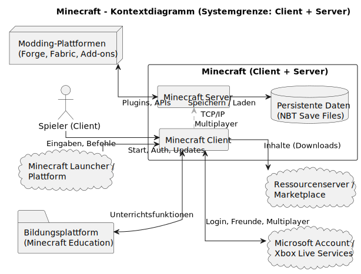

# arc42 Architektur-Dokumentation – Minecraft (didaktisches Modell)

Dieses Dokument beschreibt in vereinfachter, didaktischer Form die Architektur von Minecraft auf Basis des arc42-Templates. Inhalte sind bewusst knapp gehalten und auf die geforderten Kapitel reduziert.

---

## 1. Einführung und Ziele
Minecraft ist eine Open-World-Sandbox-Anwendung, in der Spielende eine virtuelle Welt aus Blöcken erkunden, gestalten und verändern können. Das System kombiniert Elemente von Simulation, Kreativität, Überleben und Mehrspieler-Interaktion.

In der Realität existiert Minecraft in mehreren Editionen (u. a. Java Edition in Java und Bedrock Edition in C++), die plattformübergreifend auf Windows, macOS, Linux, Konsolen und Mobilgeräten laufen.

Dieses Architektur-Dokument beschreibt Minecraft in einem **didaktisch reduzierten Modell** mit Fokus auf:

- den Minecraft Launcher,
- den Minecraft Client,
- die Anbindung an Online-Dienste (Microsoft-/Xbox-Services, Marketplace)
- sowie das Umfeld mit Servern/Realms.

Ziel ist es, die zentralen Anforderungen, Qualitätsziele und Architekturentscheidungen übersichtlich darzustellen.

### 1.1 Anforderungen – Überblick
Dieser Abschnitt gibt einen Überblick über die wichtigsten funktionalen Anforderungen
aus Sicht der Spielenden. Die Anforderungen sind als Basis-Anwendungsfälle des
Minecraft Launchers und des Minecraft Clients formuliert und decken die typischen
Aufgaben im Alltag eines Spielers ab.

Die detaillierte Darstellung der Anwendungsfälle erfolgt in den beiden
Anwendungsfalldiagrammen:

- Minecraft Launcher – Basis Use Cases
- Minecraft Client – Basis Use Cases

#### 1.1.1 Anwendungsfälle – Minecraft Launcher

System of Interest: Minecraft Launcher  
Primärer Akteur: Spieler

| ID    | Anwendungsfall          | Kurzbeschreibung |
|-------|-------------------------|------------------|
| LA-UC1 | Anmelden               | Der Spieler meldet sich im Launcher mit seinem Microsoft-/Xbox-Konto an. Der Launcher leitet die Authentifizierung an die Microsoft/Xbox Services weiter und erhält ein gültiges Login-Token. |
| LA-UC2 | Version auswählen      | Der Spieler wählt die gewünschte Minecraft-Version oder Edition (zum Beispiel Java, Bedrock, bestimmte Release- oder Snapshot-Version), die später gestartet werden soll. |
| LA-UC3 | Spiel starten          | Der Spieler startet aus dem Launcher die ausgewählte Minecraft-Version. Der Launcher übergibt die notwendigen Parameter (Version, Profil, Pfade) an den Minecraft Client und startet diesen. |
| LA-UC4 | Updates herunterladen  | Der Launcher prüft verfügbare Updates für die installierten Minecraft-Versionen und lädt diese bei Bedarf herunter, sodass der Client auf dem aktuellen Stand bleibt. |

#### 1.1.2 Anwendungsfälle – Minecraft Client

System of Interest: Minecraft Client  
Primärer Akteur: Spieler

| ID    | Anwendungsfall               | Kurzbeschreibung |
|-------|------------------------------|------------------|
| CL-UC1 | Anmelden                    | Der Spieler meldet sich im Minecraft Client mit seinem Konto an. Der Client verwendet die vom Launcher bzw. von den Microsoft/Xbox Services bereitgestellten Authentifizierungsinformationen oder führt bei Bedarf eine erneute Anmeldung durch. |
| CL-UC2 | Spielen (Singleplayer)      | Der Spieler erstellt eine neue Einzelspieler-Welt oder lädt eine bestehende Welt. Der Client simuliert die Spielwelt lokal, speichert Fortschritt und ermöglicht Aktionen, Interaktionen und Chat innerhalb dieser Welt. |
| CL-UC3 | Multiplayer-Spiel beitreten | Der Spieler wählt einen Minecraft-Server oder Realm aus und tritt dem Spiel bei. Der Client baut eine Netzwerkverbindung zum Minecraft Server beziehungsweise zu Realms auf, authentifiziert den Spieler und synchronisiert Weltzustand, Bewegungen und Chat. |
| CL-UC4 | Inhalte laden/kaufen        | Der Spieler durchsucht verfügbare Inhalte (zum Beispiel Skins, Texture Packs, Welten) und lädt oder kauft diese über den Minecraft Marketplace. Der Client kommuniziert mit dem Marketplace, lädt die Inhalte herunter und aktiviert sie im Spiel. |
| CL-UC5 | Profil verwalten            | Der Spieler verwaltet seine Profileinstellungen (zum Beispiel Skin, Steuerungs- und Grafikoptionen, Sprache). Der Client speichert diese Einstellungen und verwendet sie für zukünftige Spielsitzungen. |

### 1.2 Qualitätsziele

Die folgenden Qualitätsziele haben für die Architektur des Minecraft-Modells die höchste Priorität  
(1 = höchste Priorität):

| Prio | Qualitätsziel                | Beschreibung / Beispiel                                                                 |
|------|------------------------------|-----------------------------------------------------------------------------------------|
| 1    | Performance und Skalierung   | Der Client und Server halten auch bei vielen gleichzeitigen Spielern eine stabile Tick-Rate und laden Chunks effizient nach. |
| 2    | Stabilität und Datenintegrität | Welt- und Spielerzustände werden zuverlässig gespeichert; nach einem Absturz geht höchstens ein sehr kleiner Teil des Fortschritts verloren. |
| 3    | Erweiterbarkeit              | Mods, Plugins und Datapacks können über klar definierte Erweiterungspunkte und APIs integriert und ohne Code-Anpassung im Kernsystem aktiviert/deaktiviert werden. |
| 4    | Sicherheit und Fairness      | Nur korrekt authentifizierte Spieler können beitreten; serverseitige Autorität und Berechtigungssysteme verhindern Manipulationen und Cheating. |
| 5    | Wartbarkeit und Transparenz  | Logging, Monitoring und gut strukturierte Konfiguration ermöglichen Betrieb und Support eine schnelle Fehleranalyse und gezielte Optimierungen. |

Weitere, detailliertere Qualitätsanforderungen können bei Bedarf in Abschnitt 10 (Quality Requirements) verfeinert werden.

### 1.3 Stakeholder

Die wichtigsten Stakeholder des Minecraft-Modells und ihre Erwartungen an Architektur und Dokumentation:

| Rolle / Name                         | Beschreibung                                                | Erwartungen an Architektur und Dokumentation                              |
|--------------------------------------|-------------------------------------------------------------|----------------------------------------------------------------------------|
| Spielende                            | Personen, die Minecraft über Launcher und Client nutzen     | Verständliche Beschreibung der Hauptfunktionen und Szenarien (z. B. Singleplayer, Multiplayer, Inhalte kaufen). |
| Community-Entwickelnde (Mods/Tools)  | Entwickelnde von Mods, Datapacks oder Tools                 | Klare Erweiterungspunkte, stabile Schnittstellen und Hinweise zu Beschränkungen. |
| Server-Administrationen / Hoster     | Betreibende von Multiplayer-Servern oder Realms             | Überblick über relevante Komponenten, Schnittstellen zu Server/Realms und Qualitätsziele bezüglich Performance, Stabilität und Sicherheit. |
| Hersteller / Produktverantwortliche  | Verantwortliche für Produktstrategie, Betrieb und Support   | Nachvollziehbare Architekturentscheidungen, Sicht auf Qualitätsziele, Risiken und Auswirkungen auf Betrieb und Weiterentwicklung. |
| Lehrende / Dozent (didaktisches Modell) | Nutzt die Dokumentation als Bewertungsgrundlage und Beispiel | Kompakte, konsistente Dokumentation gemäß arc42 mit korrekt eingesetzten Diagrammen und klaren Beschreibungen. |

Diese Rollen tauchen (teilweise mit leicht anderen Bezeichnungen) auch in den Kontext- und Anwendungsfalldiagrammen auf und sorgen so für Konsistenz zwischen Text und Diagrammen.

---

## 2. Randbedingungen

### 2.1 Technische Randbedingungen

- Sprachen/Plattformen: Java (Java Edition), C++ (Bedrock), Plattformen Desktop/Mobile/Konsole.
- Architekturgrundsatz: Durchgängiges Client-Server-Modell mit serverseitiger Autorität.
- Persistenz: Chunk-basierte Speicherung in binären, strukturierten Formaten (z. B. NBT) für Welt- und Spielerzustände.
- Netzwerk: Paketbasiertes Protokoll über TCP/IP bzw. etablierte Transportprotokolle.

### 2.2 Organisatorische Randbedingungen
- Kontinuierliche Weiterentwicklung bei Schutz bestehender Welten (Abwärtskompatibilität und Migration).
- Aktive Community-Unterstützung (Erweiterbarkeit, stabile APIs an definierten Punkten).

---

## 3. Kontextabgrenzung
Dieses Kapitel beschreibt den Kontext des Systems „Minecraft“ (didaktisches Modell).
Unter „Minecraft“ verstehen wir hier das **Spielsystem als Blackbox** (Client-/Server-Funktionalität, Login, Lizenz- und Shop-Anbindung).

Die Kontextdiagramme zeigen:
- fachliche Nachbarn (Rollen und externe Systeme) und die zwischen ihnen ausgetauschten Informationen
- technische Kanäle, über welche diese Informationen übertragen werden  
Damit wird klar abgegrenzt, was zum System gehört und **welche Schnittstellen** zu seiner Umgebung existieren.

### 3.1 Fachlicher Kontext (Business Context)

Das fachliche Kontextdiagramm zeigt „Minecraft“ als Blackbox. Rund um das System sind folgende fachliche Kommunikationspartner angeordnet:

- Spielende  
- Community-Entwickelnde  
- Server-Administrationen / Hoster  
- Betrieb / Support (Hersteller)  
- Identitätsdienst (Microsoft Account)  
- Zahlungsdienstleister / Store (Microsoft Commerce)  

Die Pfeile im Diagramm benennen die fachlichen Informationsflüsse, zum Beispiel:

- „Spielen, Chatten, Inhalte nutzen“ zwischen Spielenden und Minecraft  
- „Inhalte bereitstellen (Mods/Datapacks)“ zwischen Community-Entwickelnden und Minecraft  
- „Mehrspieler verwalten, Moderation/Konfiguration“ zwischen Server-Administrationen/Hostern und Minecraft  
- „Betrieb, Support, Updates“ zwischen Hersteller und Minecraft  
- „Konten & Lizenzen (Anmeldung)“ zwischen Minecraft und Identitätsdienst  
- „Zahlungsabwicklung (Käufe, Abos)“ zwischen Minecraft und Zahlungsdienstleister / Store  

Damit ist der fachliche Kontext nachvollziehbar abgegrenzt; weniger relevante Nachbarsysteme (z. B. Analytics- oder Werbedienste) werden im didaktischen Modell bewusst weggelassen.  

##### Kurzbeschreibung der fachlichen Schnittstellen

| Kommunikationspartner                        | Rolle / Motivation                                                                 | Eingaben an „Minecraft“ (vom Partner zum System)                                                | Ausgaben von „Minecraft“ (vom System zum Partner)                                            |
|---------------------------------------------|------------------------------------------------------------------------------------|--------------------------------------------------------------------------------------------------|------------------------------------------------------------------------------------------------|
| Spielende                                   | Nutzen das Spiel, interagieren mit der Welt und anderen Spielenden                | Steuerbefehle, Bewegungen, Interaktionen, Chat-Nachrichten, Auswahl von Inhalten („Spielen, Chatten, Inhalte nutzen“) | Welt- und Spielzustand, Rückmeldungen zu Aktionen, Chat-Nachrichten, verfügbare Inhalte       |
| Community-Entwickelnde                      | Stellen zusätzliche Inhalte wie Mods und Datapacks bereit                         | Bereitstellung von Inhalten („Inhalte bereitstellen (Mods/Datapacks)“)                          | Schnittstellen und Ladepunkte für diese Inhalte, Status ob Inhalte aktiv/verfügbar sind       |
| Server-Administrationen / Hoster            | Betreiben und konfigurieren Multiplayer-Server, moderieren das Spiel              | Konfiguration, Start/Stop des Servers, Moderationsaktionen („Mehrspieler verwalten, Moderation/Konfiguration“) | Statusmeldungen, Logs, Rückmeldungen zu Konfigurations- und Moderationsaktionen               |
| Betrieb / Support (Hersteller)              | Verantwortlich für Betrieb, Support, Fehlerbehebung und Updates                   | Patches/Updates, Supportvorgaben, Betriebsrichtlinien („Betrieb, Support, Updates“)             | Telemetrie- und Fehlerdaten, Log-Informationen, Rückmeldungen zum Update-Status               |
| Identitätsdienst (Microsoft Account)        | Verwalten Benutzerkonten und Anmeldungen                                          | Authentifizierungsanfragen, Token-Validierung („Konten & Lizenzen (Anmeldung)“)                 | Identität der Spielenden, Konten- und Lizenzinformationen                                     |
| Zahlungsdienstleister / Store (Microsoft Commerce) | Abwicklung von Käufen, Abos und Lizenzen                                         | Kauf- und Aboanforderungen, Zahlungsdaten („Zahlungsabwicklung (Käufe, Abos)“)                  | Bestätigte Käufe, Lizenzen/Entitlements, Rechnungsinformationen                               |

**Kontextdiagramm Minecraft-Referenzarchitektur** (Client, Server, Auth-Services, Launcher, Mod-Repos, lokales Dateisystem).

### 3.2 Technischer Kontext (Technical Context)
Das technische Kontextdiagramm betrachtet dieselben Kommunikationspartner, legt aber den Fokus auf die technischen Kanäle und Schnittstellen zwischen Minecraft und seiner Umgebung.

Aus Sicht der Architektur werden insbesondere folgende technischen Verbindungen unterschieden:

- Spiel-Clients (PC, Konsole, Mobile) verbinden sich über das Internet mittels eines Minecraft-Game-Protokolls (TCP/UDP) mit dem Server.
- Server-Administrationen greifen über Management-Kanäle wie Remote-Konsole, SSH oder Web-Adminoberflächen auf das System zu.
- Der Identitätsdienst „Microsoft Account“ wird über HTTPS-basierte Web-APIs angesprochen (Anmeldung, Token-Validierung, Lizenzabfragen).
- Der Zahlungsdienstleister / Store „Microsoft Commerce“ wird ebenfalls über HTTPS-APIs eingebunden (Zahlungsabwicklung, Entitlement-Abfragen).

##### Kurzbeschreibung der technischen Schnittstellen

| Technischer Kanal / Schnittstelle          | Beteiligte Systeme / Partner                                           | Zweck (zugehörige fachliche Flüsse)                                                          |
|-------------------------------------------|------------------------------------------------------------------------|-----------------------------------------------------------------------------------------------|
| Game-Protokoll über Internet (TCP/UDP)    | Spiel-Client der Spielenden ↔ Minecraft-Server                         | Übertragung der Spielaktionen und Welt-Updates, Chat-Nachrichten, Mehrspieler-Synchronisation |
| Admin-/Management-Zugänge (z. B. RCON, SSH, Web-Admin) | Server-Administrationen / Hoster ↔ Minecraft-Server                  | Verwaltung der Server-Konfiguration, Logs, Moderations- und Betriebsaktionen                  |
| HTTPS-API „Microsoft Account“             | Minecraft-Server ↔ Identitätsdienst (Microsoft Account)                | Anmeldung der Spielenden, Validierung von Konten und Lizenzen („Konten & Lizenzen (Anmeldung)“) |
| HTTPS-API „Microsoft Commerce“            | Minecraft-Server ↔ Zahlungsdienstleister / Store (Microsoft Commerce)  | Abwicklung von Käufen und Abos, Verwaltung der Entitlements („Zahlungsabwicklung (Käufe, Abos)“) |

---

## 4. Lösungsstrategie
- Serverseitig autoritative Spiel- und Konsistenzlogik.
- Chunk-basierte Weltrepräsentation und Streaming.
- Event-/Tick-getriebene Verarbeitung mit deterministischen Regeln.
- Erweiterbarkeit über definierte Extension-Points (Datapacks, Plugins/Mods).
- Klare Trennung von Client-Rendering und Server-Logik.

(Details zu den wichtigsten Entscheidungen siehe Kapitel 9.)

---

## 5. Bausteinsicht
Hauptbausteine:

- **Client:** Rendering, Eingabe, UI, lokaler Cache sowie optional integrierter Server im Singleplayer.
- **Server:** Verwaltung von Welt- und Spielzustand, Game-Loop/Ticks, Regeln, KI, Weltspeicher.
- **Persistenz:** Speicherung von Welten, Spielerständen und Konfigurationen in strukturierten, binären Formaten (z. B. NBT, Region-Dateien).
- **Netzwerk:** Sitzungs- und Paketverwaltung, Serialisierung/Kompression, Behandlung von Latenz und Paketverlust.

---

## 6. Laufzeitsicht
### 6.1 Verbindungsaufbau
1. Client authentifiziert sich über Microsoft/Xbox Services.
2. Client baut TCP/IP-Verbindung zum (Realms- oder eigenen) Server auf.
3. Server prüft Berechtigungen und sendet Initialdaten (Spielerzustand, Spawn-Position, erste Chunks).
4. Client lädt/initialisiert Ressourcen und wechselt in den laufenden Spielzustand.

### 6.2 Spieltakt (Tick)
1. Client sendet Eingaben (Bewegung, Aktionen) an den Server.
2. Server verarbeitet pro Tick alle Eingaben, Entities, Physik und Regeln.
3. Server aktualisiert den Weltzustand und berechnet relevante Deltas je Spieler.
4. Server sendet Deltas (Positionsupdates, Blockänderungen, Events) an die verbundenen Clients.
5. Clients rendern den neuen Zustand lokal.

---

## 7. Verteilungssicht
Die Verteilungssicht beschreibt die technische Infrastruktur, auf der das Minecraft-System
(im didaktischen Modell) ausgeführt wird, sowie die Zuordnung der wichtigsten
Softwareartefakte zu diesen Infrastrukturknoten.

Typische Topologien:

- Clients (Desktop-PC, Konsole, Mobilgerät) verbinden sich über TCP/IP mit einem
  dedizierten Minecraft-Server (Java).
- Alternativ nutzen Spielende Minecraft Realms als Managed Service in der Cloud
  (Realms-Server mit verwaltetem Storage).
- Im Singleplayer läuft ein integrierter Server direkt im Prozess des
  „Minecraft Client (Java)“ auf dem Desktop-PC.

Das folgende Deployment-Diagramm modelliert diese Infrastruktur auf einem
abstrakten Level (Infrastruktur Level 1):

### 7.1 Verteildiagramm
### 7.1 Infrastruktur Level 1

#### Motivation

Die dargestellte Infrastruktur spiegelt die realen Einsatzszenarien von Minecraft
wider:

- **Desktop-PC** mit **Launcher** und **Minecraft Client (Java)** als typische
  Umgebung für die Java-Edition. Der integrierte Server ermöglicht hier
  Singleplayer-Welten und kleine lokale Mehrspieler-Szenarien.
- **Konsole / Mobilgerät** mit **Minecraft Client (Bedrock)** bildet die
  Bedrock-Edition auf Plattform-OS (z. B. Xbox, PlayStation, Switch, iOS, Android) ab.
- Ein **Eigenes Server-System** mit **Minecraft Server (Java)** stellt dedizierte
  Multiplayer-Server bereit, die unabhängig vom Client skalieren und optional
  Plugins ausführen.
- **Minecraft Realms (Cloud)** repräsentiert den von Mojang/Microsoft betriebenen
  Managed Service mit Realms-Servern und verwaltetem Storage.
- **Xbox Live / Microsoft Account** ist als externer Knoten modelliert und
  übernimmt Authentifizierung und Kontenverwaltung.
- **World & Player Storage** sowie **Plugin-DB** und **Managed Storage** bilden die
  Persistenzschicht für Welt-, Spieler- und Plugin-Daten ab.
- **Modding (Forge/Fabric)** steht für Entwicklungsumgebungen, die Plugins
  bereitstellen, die später auf dem **Minecraft Server (Java)** ausgeführt werden.

Damit werden die wichtigsten Ausführungsumgebungen (Clients, eigener Server,
Realms-Cloud) und deren Verbindungen abgedeckt.

#### Quality- und Performance-Merkmale der Infrastruktur

- **Skalierbarkeit:** Durch die Trennung von Clients und dedizierten Servern
  (Eigenes Server-System, Minecraft Realms (Cloud)) kann die Spielerzahl pro
  Server instanzabhängig skaliert werden.
- **Performance:** Netzwerkkommunikation erfolgt über **TCP/IP**, Persistenz
  von Welt- und Spieler-Daten wird lokal auf dem Server in
  `World & Player Storage (Filesystem: NBT/Anvil .mca)` gehalten.
- **Verfügbarkeit:** Realms-Server laufen in einer Cloud-Umgebung mit
  **Managed Storage**, was eine höhere Verfügbarkeit als ein einzelner,
  privat betriebener Server ermöglicht.
- **Erweiterbarkeit:** Die optionale **Plugin-DB (SQLite/MySQL/PostgreSQL)**
  und das Artefakt **Modding (Forge/Fabric)** ermöglichen Server-Erweiterungen,
  ohne die Kernanwendung zu verändern.

#### Mapping der Bausteine auf die Infrastruktur

| Infrastrukturknoten                               | Enthaltene Softwareartefakte / Bausteine                                       | Bemerkungen |
|---------------------------------------------------|----------------------------------------------------------------------------------|------------|
| **Desktop-PC** / **Desktop OS**                   | `Launcher`, `Minecraft Client (Java)`, `Integrated Server`                      | Launcher installiert und startet den Minecraft-Client. Der Integrated Server läuft im gleichen Prozess für Singleplayer. |
| **Konsole / Mobilgeraet** / **Plattform-OS**      | `Minecraft Client (Bedrock)`                                                    | Bedrock-Client verbindet sich direkt mit Realms oder dedizierten Bedrock-Servern (im Diagramm durch Realms-Server repräsentiert). |
| **Eigenes Server-System** / **Server OS**         | `Minecraft Server (Java)`, `World & Player Storage (Filesystem: NBT/Anvil .mca)`, `Plugin-DB (SQLite/MySQL/PostgreSQL)` | Dedizierter Java-Server, der Welt- und Spieler-Daten lokal speichert und optional Plugins aus einer Plugin-Datenbank lädt. |
| **Minecraft Realms (Cloud)** / **Managed Service**| `Realms-Server (Java/Bedrock)`, `Managed Storage`                               | Managed Service betrieben von Mojang/Microsoft; Persistenz wird durch Managed Storage bereitgestellt. |
| **Xbox Live / Microsoft Account**                 | – (externer Identitätsdienst)                                                   | Dient ausschließlich der Authentifizierung (`Anmeldung`) von Launcher, Java-Client und Bedrock-Client. |
| **Modding (Forge/Fabric)**                        | – (Artefakte: Mods, Plugins)                                                    | Entwicklungs- und Build-Umgebung; erzeugte Plugins werden über die Verbindung `Plugins` dem `Minecraft Server (Java)` bereitgestellt. |

Die im Mapping verwendeten Bezeichnungen entsprechen den Elementen im
Verteilungsdiagramm (z. B. `Minecraft Client (Java)`, `Minecraft Server (Java)`,
`World & Player Storage (Filesystem: NBT/Anvil .mca)`), sodass Diagramm und
Kurzbeschreibungen konsistent sind.

---

## 8. Querschnittliche Konzepte
- Persistenz/Dateiformate (z. B. NBT) und Migration alter Welten.
- Konfiguration, Logging und Monitoring.
- Sicherheit (Authentifizierung/Autorisierung, Rechte, grundlegende Anti-Cheat-Mechanismen).
- Erweiterbarkeit (Datapacks/Plugins, Versionierung und Stabilität der APIs).
- Fehler- und Ressourcenmanagement (Speicher, Threads, IO, Chunk-Loading).

---

## 9. Architekturentscheidungen
- Client-Server mit serverseitiger Autorität für Konsistenz und Fairness.
- Chunking als Strategie für Skalierung und Streaming der Welt.
- Erweiterbarkeit über klar abgegrenzte Extension-Points (Datapacks, Plugin-APIs).
- Binäre, strukturierte Datenformate für Welten und Zustände.

---

## 10. Qualitätsanforderungen (Szenarien)
- **Performance:** Welt-Streaming liefert sichtbare Chunks in ≤ 200 ms (didaktischer Richtwert).
- **Stabilität:** Welt-Speicheroperationen bleiben konsistent bei Crash/Recovery (keine korrupten Chunks).
- **Sicherheit:** Unautorisierte Aktionen werden serverseitig verworfen und protokolliert; kompromittierte Clients können die Welt nicht inkonsistent manipulieren.

---

## 11. Risiken und technische Schulden
- Cheat-/Exploit-Risiken und Angriffsfläche im Netzwerkprotokoll.
- Kompatibilität alter Weltdaten bei Format- und Regeländerungen.
- Interoperabilität und Isolation zwischen Mods/Plugins (Konflikte, Performanceeinbrüche).

---

## 12. Glossar

### 12.1 Inhalt
Die wichtigsten fachlichen und technischen Begriffe, die beim Beschreiben der Minecraft-Referenzarchitektur verwendet werden.  
Das Glossar dient ausserdem als Referenz für Übersetzungen zwischen deutsch- und englischsprachigen Stakeholdern.

### 12.2 Motivation
Eindeutig definierte Begriffe stellen sicher, dass alle Stakeholder

- ein gemeinsames Verständnis zentraler Konzepte haben.
- keine mehrdeutigen Synonyme oder Homonyme verwenden.

### 12.3 Form

- Einfache Tabelle mit den Spalten `Begriff` und `Definition`.
- Zusätzlich eine Spalte `Englischer Begriff` für Übersetzungen.

### 12.4 Begriffe

| Begriff   | Definition                                                                                                   | Englischer Begriff     |
|----------|--------------------------------------------------------------------------------------------------------------|------------------------|
| Chunk    | Fester Abschnitt der Spielwelt, der gemeinsam geladen, gespeichert und über das Netz übertragen wird.       | Chunk                  |
| Tick     | Fester Verarbeitungsschritt des Servers, in dem Spielregeln, Physik und Zustände aktualisiert werden.       | Tick                   |
| NBT      | Binäres Tag-Format zur strukturierten Speicherung von Weltdaten, Spielerzuständen usw.                      | Named Binary Tag (NBT) |
| Datapack | Paket mit in Dateien definierten Spielinhalten und Regeln (z. B. Loot-Tabellen, Advancements, Funktionen).  | Data Pack              |
| Plugin   | Serverseitige Erweiterung, die zusätzliche Logik über definierte Erweiterungspunkte einbindet.              | Plugin                 |
| Welt     | Gesamtheit aller Chunks, Dimensionen und gespeicherten Zustände eines Spielstands.                          | World                  |
| Dimension| Logisch getrennte Teilwelt mit eigener Geometrie und eigenen Regeln (z. B. Overworld, Nether).              | Dimension              |
| Entity   | Dynamisches Objekt in der Welt, z. B. Spieler, Mobs, Projektile oder Item-Stacks.                           | Entity                 |
| Block    | Kleinstes statisches Bauelement der Spielwelt, z. B. Stein, Erde oder Redstone-Komponente.                  | Block                  |
| Seed     | Startwert zur deterministischen Generierung einer Welt.                                                     | Seed                   |
| Server   | Autoritative Instanz, die Weltzustand, Regeln und Persistenz verwaltet.                                     | Server                 |
| Client   | Spielprogramm der Nutzenden für Rendering, Eingabe und Kommunikation mit dem Server.                        | Client                 |
=======
