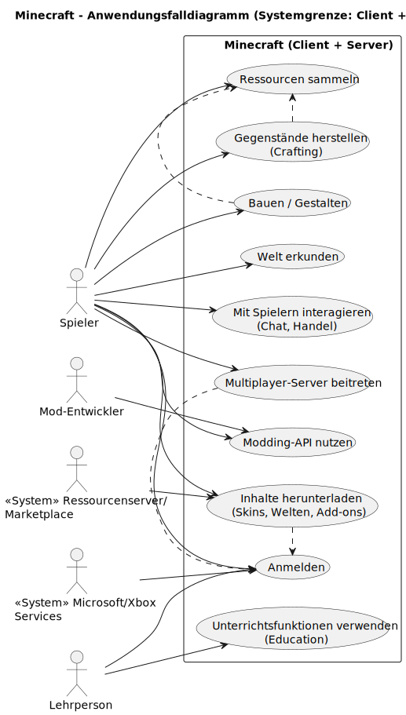

# arc42 Architektur-Dokumentation  
## Minecraft – Referenzarchitektur (didaktisches Modell)

**Hinweis**  
Diese Dokumentation beschreibt Minecraft als abstrahierte Referenzarchitektur auf Basis des arc42-Templates.  
Sie dient Ausbildungszwecken, fokussiert auf typische Architekturprinzipien und ersetzt keine interne Dokumentation von Mojang/Microsoft.

---

## 1. Einfuehrung und Ziele

### 1.1 Beschreibung der Anwendung

Minecraft ist eine Open-World-Sandbox-Anwendung, in der Spielerinnen und Spieler eine prozedural generierte, aus Bloecken aufgebaute 3D-Welt erkunden, gestalten und veraendern koennen.  
Das System kombiniert Elemente von Erkundung, Ressourcenmanagement, Ueberlebensmechaniken, Bauen, Automatisierung, Handel, Bildungsszenarien und kompetitivem Spiel.

Wesentliche Eigenschaften:

- Voxelbasierte 3D-Welt mit Bloecken als Grundeinheit
- Persistente Welten mit Tag-/Nacht-Zyklus, Wetter, Kreaturen (Mobs) und Strukturen
- Verschiedene Spielmodi (Survival, Creative, Adventure, Spectator, Hardcore)
- Einzelspieler und Mehrspieler mit gemeinsamen Welten
- Erweiterbarkeit durch Resource Packs, Datapacks, Mods, Plugins und Add-ons

Technische Basis:

- Minecraft: Java Edition (Java)
- Minecraft: Bedrock Edition (C++ und plattformspezifische Komponenten)
- Zielplattformen: Windows, macOS, Linux, Konsolen, Mobile, Education-spezifische Umgebungen

### 1.2 Aufgabenstellung

Die Architektur von Minecraft soll eine langfristig tragfaehige Plattform bieten, die:

- sehr grosse, persistente Welten performant und konsistent verwaltet
- Einzelspieler-, LAN- und Internet-Multiplayer-Szenarien ermoeglicht
- serverseitig autoritative Spiellogik zur Sicherstellung von Fairness und Konsistenz bereitstellt
- auf unterschiedlichen Plattformen mit variierender Hardware performant betrieben werden kann
- eine aktive Community aus Mod-Entwicklern, Content Creators und Serverbetreibenden gezielt unterstuetzt
- regelmaessige Updates, neue Inhalte und Editionsvarianten ermoeglicht, ohne bestehende Welten systematisch zu brechen

Diese Referenzarchitektur abstrahiert typische Muster von Java Edition, Bedrock Edition, Realms, Dedicated Servern und Education Edition zu einem einheitlichen, didaktischen Modell.

### 1.3 Qualitaetsziele

1. **Performance & Skalierung**  
   Spielbare Bildraten und stabile Tick-Raten auch bei grossen Welten, vielen Entitaeten und mehreren Dutzend bis Hunderten gleichzeitigen Spielenden.
2. **Stabilitaet & Datenintegritaet**  
   Hohe Zuverlaessigkeit beim Speichern und Laden von Welten und Spielerfortschritten; Minimierung der Gefahr von Datenkorruption.
3. **Erweiterbarkeit & Offenheit**  
   Klare Erweiterungspunkte fuer Mods, Plugins, Datapacks, Resource Packs und Add-ons bei gleichzeitig geschuetztem Kern.
4. **Sicherheit & Fairness**  
   Schutz vor Cheating, Exploits und unautorisierten Zugriffe durch serverseitige Autoritaet, Authentifizierung und konfigurierbare Rechte.
5. **Plattformvielfalt & Konsistenz**  
   Konsistentes Spielerlebnis ueber verschiedene Plattformen hinweg, bei gleichzeitiger Optimierung fuer die jeweilige Zielumgebung.
6. **Wartbarkeit & Transparenz**  
   Verstaendliche Logs, Crash-Reports, Konfigurationsmechanismen und dokumentierte Schnittstellen.

### 1.4 Stakeholder

- Spielende (Casual, Kreativbau, Survival, kompetitiv)
- Community-Entwicklerinnen und -Entwickler (Mods, Plugins, Tools)
- Server-Administratoren und Hoster
- Mojang Studios / Microsoft (Produktverantwortung, Marke, Einnahmen, Compliance)
- Lehrpersonen und Bildungseinrichtungen (Minecraft Education)
- Plattformbetreiber (Konsolenhersteller, App-Store-Betreiber)

---

## 2. Randbedingungen

### 2.1 Technische Randbedingungen

- Programmiersprachen:
  - Java Edition: Java
  - Bedrock Edition: C++ (Engine-nahe, plattformspezifische Anpassungen)
- Architektur:
  - Durchgaengiges Client-Server-Modell; im Singleplayer ein lokaler integrierter Serverprozess
- Persistenz:
  - Chunk-basierte Speicherung
  - Binaere, strukturierte Formate (z. B. NBT) fuer Weltdaten, Spielerprofile, Konfigurationen
- Netzwerk:
  - Proprietaere, paketbasierte Protokolle auf Basis etablierter Transportprotokolle
- Plattformen:
  - Desktop, Konsole, Mobile, Education-Umgebungen
- Distribution:
  - Minecraft Launcher, Plattform-Stores, Education-Portale, Realms-Verwaltung

### 2.2 Organisatorische Randbedingungen

- Zentrale Produkt- und Architekturverantwortung bei Mojang/Microsoft
- Gemeinsame Marken- und Qualitaetsanforderungen fuer alle Editionen
- Kontinuierliche Weiterentwicklung bei gleichzeitigem Schutz bestehender Welten (Abwaertskompatibilitaet, Migrationspfade)
- Starke Einbindung der Community (Feedback, Modding, Serverlandschaft)

### 2.3 Rechtliche Randbedingungen

- Proprietaere Lizenz- und Nutzungsbedingungen (EULA)
- Markenrichtlinien fuer Minecraft-bezogene Inhalte und Server
- Vorgaben fuer Monetarisierung von Servern und Inhalten
- Datenschutz- und Compliance-Anforderungen fuer Online-Dienste
- Einhaltung plattformspezifischer Richtlinien (z. B. Konsolen, Mobile-Stores)

---

## 3. Kontextabgrenzung

### 3.1 Systemuebersicht

**Im Scope dieser Architekturbetrachtung:**

- Minecraft-Client (Rendering, UI, Eingabe, Client-Netzwerk)
- Minecraft-Server (integriert, dediziert, Realms, Education-Server)
- Persistenzschicht (Weltdaten, Spielerprofile, Konfiguration)
- Offizielle Erweiterungsmechanismen (Resource Packs, Datapacks, Add-ons, APIs)

**Ausserhalb, aber relevant:**

- Microsoft-/Xbox-Accounts und zentrale Authentifizierungsdienste
- Minecraft Launcher und Plattform-Stores
- Externe / Community-Server und Hosting-Anbieter
- Modding- und Plugin-Plattformen von Drittanbietern
- Education-spezifische Verwaltungsplattformen und Schul-Infrastrukturen

### 3.2 Externe Akteure und Systeme

| Akteur / System                 | Beschreibung                                          | Interaktion                                |
|---------------------------------|-------------------------------------------------------|--------------------------------------------|
| Spielende                       | Endnutzerinnen und Endnutzer                         | Spiel, Chat, Einstellungen, Kauefe         |
| Launcher / Store                | Distribution, Lizenzpruefung, Updates                 | Login, Download, Update, Start             |
| Microsoft-/Xbox-Services        | Identitaets- und Sitzungsverwaltung                   | Authentifizierung, Profil, Realms-Zugriff  |
| Community-/Dedicated-Server     | Von Dritten betriebene Mehrspielerserver             | Client-Verbindung via Serverprotokoll      |
| Modding-/Plugin-Plattformen     | Austausch und Distribution von Mods/Plugins           | Download, Dokumentation                    |
| Marketplace / Content-Plattform | Verkauf und Bereitstellung offizieller Inhalte       | Kauefe, Lizenzpruefung, Download           |
| Bildungseinrichtungen           | Nutzung von Minecraft Education                       | Klassensteuerung, Bereitstellung von Welten|

### 3.3 Kontextdiagramm

Das Kontextdiagramm zeigt Clients, Server, Identitaetsdienste, Distribution und externe Inhalte im Ueberblick.

### 3.4 Anwendungsfalldiagramm
Das Anwendungsfalldiagramm stellt zentrale Interaktionen schematisch dar, insbesondere:

- Welt erkunden und bauen
- Ressourcen abbauen und verarbeiten
- Kaempfen und Ueberleben
- Mehrspieler-Spiel beitreten / hosten
- Server administrieren
- Inhalte und Erweiterungen nutzen (Resource Packs, Datapacks, Mods, Add-ons)
- In Education-Szenarien Welten bereitstellen, Aufgaben steuern

Die Visualisierung zeigt dabei Spielende, Server-Administratoren und Lehrpersonen als Akteure und ihre jeweiligen Anwendungsfaelle im Zusammenspiel mit Client und Server.

---

## 4. Loesungsstrategie

### 4.1 Architekturstil und Leitprinzipien

- Strikte **Client-Server-Architektur** mit serverseitiger Autoritaet
- **Schichten- und Komponentenarchitektur** fuer Client, Server, Persistenz und Erweiterungen
- **Ereignis- und datengetriebenes Design** (Events, Hooks, Konfiguration statt Hardcoding)
- **Produktlinien-Ansatz**:
  - Gemeinsame Architekturprinzipien fuer Java, Bedrock, Education, Realms
- Offenheit fuer kontrollierte Erweiterbarkeit

### 4.2 Strategien zur Erreichung der Qualitaetsziele

- Performance: Chunking, Tick-System, Caching, Sichtweitensteuerung
- Stabilitaet: Robust gespeicherte Weltdaten, Crash-Handling, Wiederanlauf
- Erweiterbarkeit: Offizielle Schnittstellen, strukturierte Datenformate
- Sicherheit: Autoritativer Server, zentrale Authentifizierung, restriktive Rechte
- Portabilitaet: Abstraktionsschichten fuer Rendering, Input, Filesystem und Netzwerk

---

## 5. Bausteinsicht (Building Block View)

### 5.1 Gesamtuebersicht

Die Bausteinsicht gliedert das System in Client, Server, Persistenz und Querschnittsfunktionen:

+-----------------------------------------------------------+
|                     Minecraft System                      |
+-----------------------------------------------------------+
|  Client Layer   |  Server Layer   |  Persistence Layer    |
+-----------------------------------------------------------+
|   Cross-Cutting & Extension Layer (APIs, Mods, Add-ons)   |
+-----------------------------------------------------------+

### 5.2 Client Layer

**Verantwortungen**

- Rendering der Spielwelt und Benutzeroberflaechen
- Verarbeitung von Eingaben (Maus, Tastatur, Controller, Touch)
- Anzeige von Inventar, Chat, Statusinformationen, Menues
- Aufbau und Verwaltung der Netzwerkverbindung zum Server
- Lokales Caching von Chunks und Ressourcen
- Start eines integrierten Servers im Singleplayer (Java)

**Zentrale Bausteine**

- Rendering Engine
- UI/HUD-System
- Input-Abstraktion
- Netzwerk-Clientmodul
- Resource-Pack-Management

### 5.3 Server Layer

**Verantwortungen**

- Autoritative Spiellogik (Regeln, Physik, Kampf, Interaktionen)
- Verwaltung von Welten, Dimensionen, Biomen, Strukturen
- Verwaltung von Entitaeten und Block-Entitaeten
- Session-Management (Login, Logout, Zeitueberschreitung)
- Rechte- und Rollenkonzept (Operatoren, Permissions)
- Synchronisierung der relevanten Welt- und Entitaetsdaten an Clients
- Integration von Plugins/Mods auf dedizierten Servern

**Zentrale Bausteine**

- Tick-Engine (Game Loop)
- World Manager
- Entity Manager
- Game Rule Engine
- Netzwerk-Server-Endpunkt
- Command-/Admin-Interface
- Plugin-/Modding-Layer

### 5.4 Persistence Layer

**Verantwortungen**

- Speicherung von Weltdaten (Chunks, Regionen, Strukturen)
- Speicherung von Spielerprofilen (Position, Inventar, Statistiken)
- Speicherung von Konfigurationen, Whitelists, Bans, Berechtigungen
- Unterstuetzung von Backups, Restores und Migrationen

**Kernkonzepte**

- NBT-basierte und aehnliche binäre Formate
- Dateistruktur pro Weltinstanz
- Schreibstrategien zur Sicherstellung von Konsistenz

### 5.5 Netzwerk & Protokoll

**Verantwortungen**

- Aufbau, Ueberwachung und Abbau von Client-Server-Verbindungen
- Handshake mit Protokoll- und Versionspruefung
- Authentifizierungsablauf (Online-Modus)
- Serialisierung/Deserialisierung von Spielereignissen, Bewegungen, Chat, Welt-Updates
- Umgang mit Paketverlust, Latenz und Timeouts

**Schnittstellen**

- Definierte Pakettypen (Login, Status, ChunkData, EntityUpdate, Chat, Interaktion)
- Callbacks in Serverlogik und Clientdarstellung

### 5.6 Extension & Modding Layer

**Verantwortungen**

- Definition offizieller Erweiterungspunkte (Events, APIs, Registries)
- Einbindung von Mods, Plugins, Datapacks, Resource Packs, Add-ons
- Kapselung von Drittcode, um Kernlogik zu schuetzen

**Beispiele**

- Java Edition: Forge, Fabric, Bukkit/Spigot/Paper, Datapacks, Resource Packs
- Bedrock Edition: Behavior Packs, Resource Packs, Scripting APIs

---

## 6. Laufzeitsicht (Runtime View)

### 6.1 Szenario: Multiplayer-Login

1. Client startet und laedt Ressourcen.
2. Spielerin/Spieler waehlt einen Server aus.
3. Client baut eine Netzwerkverbindung zum Server auf.
4. Protokoll-Handshake und Versionsabgleich.
5. Authentifizierung ueber Microsoft-/Xbox-Services (Online-Modus).
6. Server prueft Whitelist/Bans und laedt Spielerprofil.
7. Server sendet Startposition, relevante Chunks und Entitaetsdaten.
8. Laufender Betrieb: Client sendet Aktionen; Server validiert und beantwortet mit Updates.

### 6.2 Szenario: Block platzieren

1. Spielerin/Spieler waehlt Block im Inventar.
2. Client berechnet Zielposition und sendet PlaceBlock-Anfrage.
3. Server prueft Reichweite, Rechte, Spielmodus, Kollisionen.
4. Bei Erfolg aktualisiert der Server Welt- und Inventardaten.
5. Server sendet Block-Update an alle relevanten Clients.
6. Clients aktualisieren die Darstellung.

### 6.3 Szenario: Plugin-Event (Java Dedicated Server)

1. Spieler joined den Server.
2. Server erzeugt ein PlayerJoinEvent.
3. Registrierte Plugins erhalten das Event.
4. Plugins fuehren eigene Logik aus (Begrüssung, Checks, Logging).
5. Aenderungen erfolgen ausschliesslich ueber definierte APIs; Kernlogik bleibt autoritativ.

---

## 7. Verteilungssicht (Deployment View)

### 7.1 Deployment-Varianten

- Singleplayer: Client + integrierter Serverprozess auf einem Geraet
- LAN-Server: Ein Host im lokalen Netz, weitere Clients verbinden sich
- Dedizierter Server: Separater Server in Rechenzentrum/Cloud
- Realms: Verwaltete Serverinstanzen durch Mojang/Microsoft
- Education Edition: Spezifische Deployments mit Classroom-Management

### 7.2 Beispielhafte Deployment-Ansicht

Die beispielhafte Deployment-Ansicht zeigt ein typisches Online-Szenario:

- Ein oder mehrere Minecraft-Clients (PC, Konsole, Mobile) verbinden sich ueber das Internet via TCP/IP mit einem Minecraft-Server, der entweder lokal (on-premises) oder auf einem VPS bzw. in der Cloud betrieben wird.
- Der Minecraft-Server ist fuer Spiellogik, Weltzustand und Synchronisation zustaendig und greift lokal auf die Welt- und Spieldaten (z. B. NBT-Dateien) zu.
- Parallel dazu kommuniziert der Client bei aktivem Online-Modus ueber HTTPS mit den Microsoft-/Xbox-Auth-Services, um Identitaet, Lizenzen und ggf. Realms-Zugriffe zu validieren.
- Die Verantwortlichkeiten sind klar getrennt:
  - Authentifizierung und Kontenverwaltung bei Microsoft-/Xbox-Services,
  - autoritative Spiellogik und Weltverwaltung beim Minecraft-Server,
  - Darstellung und Eingabeverarbeitung beim Client.

Diese Struktur ermoeglicht einen skalierbaren, sicheren Mehrspielerbetrieb, bei dem zentrale Dienste (Auth, Realms) von Mojang/Microsoft bereitgestellt werden, waehrend Serverbetreiber ihre Instanzen flexibel hosten koennen.

+--------------------------------------------------------------+
|                        Internet / Netzwerk                   |
+--------------------------------------------------------------+
|  +-----------------+       TCP/IP       +------------------+ |
|  | Minecraft Client| <----------------> | Minecraft Server | |
|  | (PC/Konsole)    |                    | (VPS / lokal)    | |
|  +-----------------+                    +------------------+ |
|         |                                         |          |
|         | HTTPS (Auth, Profile, Realms)           | FS       |
|         v                                         v          |
|  +-------------------+                    +----------------+ |
|  | Microsoft-/Xbox   |                    | Welt-/Spiel-   | |
|  | Auth Services     |                    | Daten (NBT)    | |
|  +-------------------+                    +----------------+ |
+--------------------------------------------------------------+

---

## 8. Querschnittliche Konzepte

### 8.1 Sicherheitskonzept

Grundsatz: **Der Server ist autoritativ, der Client nie voll vertrauenswuerdig.**

- Serverseitige Pruefung aller relevanten Aktionen (Bewegung, Schaden, Inventar, Blockaktionen)
- Nutzung von Microsoft-/Xbox-Accounts im Online-Modus
- Whitelists, Bans, Rollen- und Berechtigungssysteme
- Validierung eingehender Pakete (Struktur, Frequenz, Wertebereiche)
- Einsatz von Anti-Cheat-Mechanismen (Kern + optionale Plugins)
- Beschraenkung des Zugriffs auf Serverkonsole, Dateien und Administrationsschnittstellen

Ziel ist eine moeglichst faire, manipulationsresistente Spielumgebung bei vertretbarem Aufwand.

### 8.2 Konfigurationskonzept

Leitidee: **Verhalten wird ueber Konfiguration und Daten gesteuert, nicht ueber Ad-hoc-Codeaenderungen.**

Ebenen:

- Server-Basis-Konfiguration (z. B. `server.properties`)
- Welt- und Regelkonfiguration (Gamerules, Weltparameter)
- Erweiterungskonfigurationen (Plugins, Mods, Add-ons)
- Resource Packs und Datapacks fuer Inhalte und Regeln

Anforderungen:

- Klare Trennung von Standard- und projektspezifischen Einstellungen
- Dokumentierte Default-Werte
- Moeglichkeit von Anpassungen zur Laufzeit (z. B. Befehle, Skripte)

### 8.3 Fehler- und Loggingkonzept

- Zentrale Logfiles fuer Start/Stop, Warnungen, Fehler, wichtige Events
- Crash-Reports mit Umgebungsinformationen und Stacktraces
- Optionale, datenschutzkonforme Telemetrie fuer Stabilitaetsanalysen
- Konfigurierbare Log-Level und Trennung von Kernlogs und Plugin-Logs

Ziel ist eine gute Nachvollziehbarkeit von Problemen und eine effiziente Unterstuetzung von Serverbetreibenden.

### 8.4 Internationalisierung

- Alle Texte (UI, Meldungen, Itemnamen) liegen in separaten Sprachdateien vor.
- Verwendung von Lokalisierungs-Keys statt harter Texte im Code.
- Resource Packs koennen eigene Sprachdateien bereitstellen.
- Sprachwechsel ist im Client konfigurierbar ohne Einfluss auf Spielmechanik.

### 8.5 Performanz- und Skalierungskonzept

Wesentliche Mechanismen:

- Chunk-Streaming: Nur relevante Weltbereiche im Speicher
- Steuerung von Render Distance (Client) und Simulation Distance (Server)
- Tick-basiertes Verarbeitungsmodell (typisch 20 TPS)
- Begrenzung von Entitaeten, Redstone-Mechaniken und komplexen Farmen
- Vertikale Skalierung (leistungsstaerkere Hardware)
- Horizontale Skalierung durch Servernetzwerke/Proxys (Lobby-Architekturen)

Ziel: Stabiler Betrieb auch bei hoher Last und komplexen Spielwelten.

---

## 9. Architekturentscheidungen

### 9.1 Client-Server statt Peer-to-Peer

- Entscheidung fuer ein autoritatives Servermodell
- Erleichtert Cheatschutz, Konsistenz und zentrale Regelpruefung
- Fuehrt zu hoeherer Komplexitaet im Server und Latenzanforderungen

### 9.2 Chunk-basierte Weltorganisation

- Welt in logisch feste Einheiten (Chunks, Regionen) aufgeteilt
- Erlaubt effizientes Laden, Speichern und Uebertragen
- Erfordert saubere Behandlung von Effekten an Chunk-Grenzen

### 9.3 Binaere Speicherformate

- Einsatz strukturierter, binärer Formate (z. B. NBT)
- Kompakt, erweiterbar, toolfaehig
- Bedarf klarer Dokumentation und Migrationskonzepte

### 9.4 Erweiterbarkeit ueber Schnittstellen

- Offizielle APIs und Datenformate statt ausschliesslich inoffizieller Hacks
- Staerkt Community-Oekosystem, erhoeht aber Aufwand fuer Rueckwaertskompatibilitaet

### 9.5 Separate Produktlinien (Java / Bedrock)

- Unterschiedliche technische Basen fuer unterschiedliche Plattformziele
- Gemeinsame Architekturprinzipien, aber getrennte Implementierungen
- Risiko von Fragmentierung, erfordert klare Kommunikation und Synchronisation

---

## 10. Qualitaetsanforderungen

### 10.1 Qualitaetsbaum

Die wesentlichen Qualitaetsmerkmale:

- Funktionalitaet
- Zuverlaessigkeit
- Benutzbarkeit
- Effizienz
- Aenderbarkeit & Erweiterbarkeit
- Portabilitaet
- Sicherheit
- Wartbarkeit & Transparenz

### 10.2 Beispielhafte Qualitaetsszenarien

**Performance**  
Ein dedizierter Server mit 60+ aktiven Spielenden, umfangreichen Redstone-Anlagen und vielen Entitaeten haelt eine stabile Tick-Rate im akzeptablen Bereich; Latenzen bleiben fuer Spielende spielbar.

**Zuverlaessigkeit**  
Kommt es waehrend eines automatischen Speichervorgangs zu einem Absturz, kann der Server nach Neustart die Welt konsistent laden; maximal gehen wenige Sekunden Fortschritt verloren.

**Sicherheit**  
Ein modifizierter Client versucht, ungueltige Bewegungen und Item-Duplikation zu nutzen. Der Server erkennt dies anhand der Regeln und verwirft die Aktionen bzw. sperrt bei wiederholten Verstoessen den Account.

**Erweiterbarkeit**  
Ein Update fuegt neue Bloecke und Mobs hinzu. Bestehende Welten bleiben nutzbar; sauber implementierte Plugins und Datapacks funktionieren weiter oder lassen sich mit ueberschaubarem Aufwand anpassen.

**Portabilitaet**  
Eine neue Plattform kann angebunden werden, indem Rendering-, Input- und Plattformzugriffe abstrahiert und an die bestehende Logik angebunden werden.

---

## 11. Risiken und Technische Schulden

### 11.1 Fragmentierung

- Unterschiedliche Editionen, Feature-Staende und Modding-Oekosysteme
- Gefahr von Verwirrung und uneinheitlichem Nutzererlebnis

### 11.2 Abhaengigkeit von Community-Plugins

- Wichtige Funktionen haeufig ueber Dritt-Plugins implementiert
- Veraltete oder unsichere Plugins koennen Stabilitaet und Sicherheit beeintraechtigen

### 11.3 Rueckwaertskompatibilitaet

- Langfristige Unterstuetzung alter Welten erschwert tiefgreifende Architekturverbesserungen
- Bedarf an Konvertern und Migrationspfaden

### 11.4 Komplexe Performanzmechaniken

- Redstone, Entitaets-Logik und grosse Farmen koennen zu schwer nachvollziehbaren Lastspitzen fuehren
- Optimierungen im Tick- und Update-System sind komplex und fehleranfaellig

---

## 12. Glossar

**Block**  
Elementare Baueinheit der Spielwelt im voxelartigen Raster.

**Chunk**  
Fester Ausschnitt der Welt, zentrale Einheit fuer Speicherung, Laden und Uebertragung.

**Region**  
Datei-Einheit, die mehrere Chunks zusammenfasst, um I/O-Zugriffe zu optimieren.

**Biome**  
Gebiete mit spezifischen Umweltbedingungen, die Terrain, Vegetation und Mobs beeinflussen.

**NBT (Named Binary Tag)**  
Binaeres, hierarchisches Datenformat zur effizienten Speicherung von Minecraft-Daten.

**Entity**  
Dynamisches Objekt in der Welt (Spielende, Mobs, Tiere, Projektile, Fahrzeuge etc.).

**Block Entity / Tile Entity**  
Block mit zusaetzlichen Daten oder Logik (z. B. Truhe, Ofen, Beacon).

**Tick**  
Diskrete Verarbeitungseinheit der Spiel- und Serverlogik (typischerweise 20 pro Sekunde).

**Dedicated Server**  
Eigenstaendiger Serverprozess fuer Mehrspielerbetrieb ohne grafische Oberflaeche.

**Client**  
Anwendung auf dem Endgeraet, zustaendig fuer Darstellung, Eingaben und Kommunikation mit dem Server.

**Server**  
Autoritative Instanz fuer Weltzustand, Spiellogik, Rechteverwaltung und Synchronisierung.

**Client-Server-Protokoll**  
Spezifisches, paketbasiertes Protokoll zwischen Client und Server.

**Whitelist / Banliste / Permissions**  
Mechanismen zur Steuerung von Zugang und Berechtigungen auf einem Server.

---
